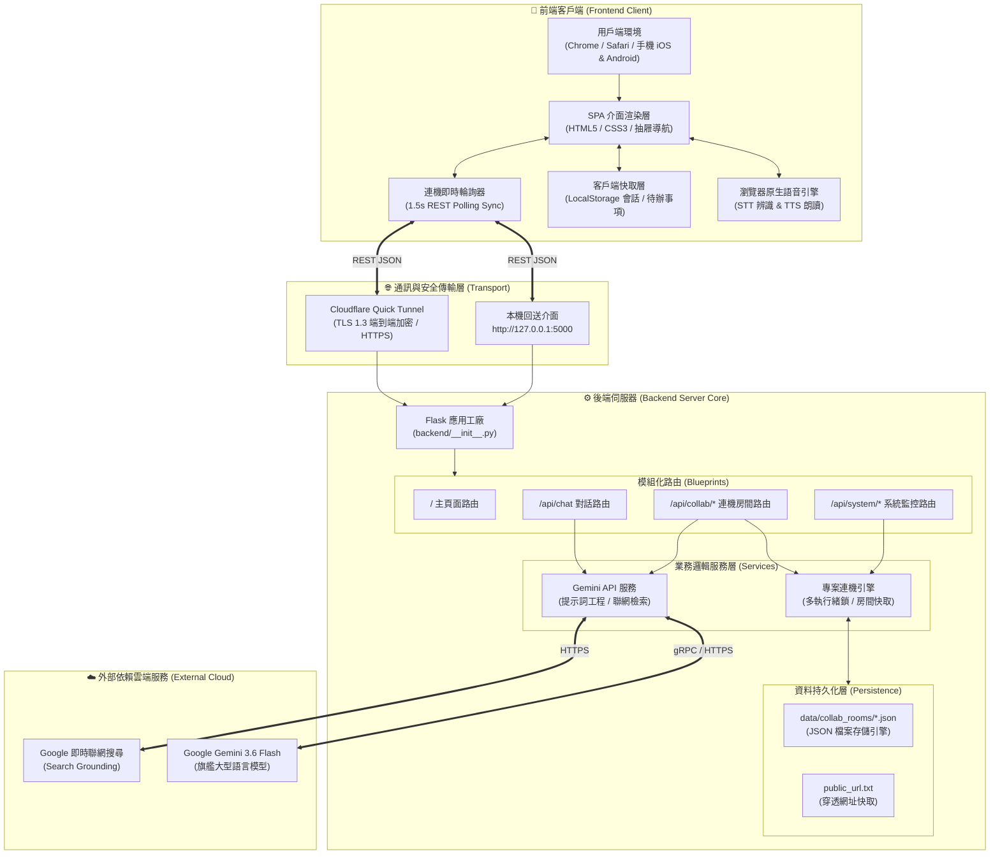

# 🏛️ Gura AI 智慧助理：系統前後端分離架構規格書 (Architecture Specification)

本專案全面實施**前後端職責分離架構（Frontend-Backend Separation Architecture）**，將用戶端展示與互動邏輯（Frontend）以及伺服器端核心服務與 AI 運算（Backend）明確劃分，確保系統具備高內聚、低耦合、模組化與易維護特性。

---

## 📊 前後端整體架構圖 (Architecture Overview)



---

## 📂 專案檔案結構劃分 (Directory Structure)

```
專案根目錄/
├── backend/                       # ⚙️ 後端核心 (Python / Flask / AI / 服務層)
│   ├── __init__.py                # 應用工廠 create_app()
│   ├── config.py                  # 集中設定檔 (API 金鑰、路徑、模型設定)
│   ├── services/                  # 獨立業務服務層
│   │   ├── __init__.py
│   │   ├── gemini_service.py      # Google Gemini 3.6 Flash API 串接與提示詞處理
│   │   └── collab_service.py      # 多人專案房間引擎、成員心跳維持、筆記同步
│   └── routes/                    # 模組化 REST API 路由藍圖
│       ├── __init__.py
│       ├── main_routes.py         # 頁面主入口渲染
│       ├── chat_routes.py         # /api/chat 對話與搜尋
│       ├── collab_routes.py       # /api/collab/* 多人連機端點
│       └── system_routes.py       # /api/system/status 與 ping 監控
│
├── frontend/                      # 🎨 前端應用層 (HTML / CSS / JavaScript)
│   ├── templates/
│   │   └── index.html             # 單頁應用 (SPA) 模板，含前後端控制台
│   └── static/
│       ├── style.css              # 響應式排版 (手機全螢幕 / 抽屜導航 / 主題色彩)
│       └── app.js                 # 前端互動邏輯、STT/TTS 控制器、架構儀表板
│
├── data/                          # 💾 後端資料層
│   └── collab_rooms/              # 專案房間資料庫 (JSON 格式)
│
├── app.py                         # 根目錄向後相容進入點 (調用 backend.create_app())
├── run_server.py                  # 背景守護與 Cloudflare 穿透管理器
├── 🚀 一鍵啟動 Gura (自動開啟網頁).bat # 桌面一鍵獨立啟動器
└── ARCHITECTURE.md                # 本規格書
```

---

## 🎯 前端與後端職責邊界對比表 (Responsibility Matrix)

| 比較維度 | 🎨 前端客戶端 (Frontend Client) | ⚙️ 後端伺服器 (Backend Server) |
| :--- | :--- | :--- |
| **主要定位** | 用戶互動與視圖展示層 | 運算推理、API 路由與資料存儲層 |
| **執行環境** | 用戶端瀏覽器 (Chrome, Safari, Edge, 手機) | 本機 Python 3.14 虛擬運行環境 |
| **核心技術** | HTML5 / Modern CSS / Vanilla JS (SPA) | Python 3.14 / Flask RESTful API |
| **主要職責** | 1. 畫面渲染與流暢動畫<br/>2. 手機全螢幕排版與抽屜選單<br/>3. Web Speech API (STT 語音收音 / TTS 朗讀)<br/>4. LocalStorage 對話紀錄與偏好<br/>5. 每 1.5 秒向後端輪詢多人連機室 | 1. 安全保護 Gemini API 金鑰（不洩漏給前端）<br/>2. 串接調度 Google Gemini 3.6 Flash 模型<br/>3. 整合即時聯網搜尋摘要<br/>4. 多人專案房間執行緒安全鎖定與持久化<br/>5. 穿透隧道健康檢查與狀態監控 |
| **數據持久化** | 瀏覽器 LocalStorage（客戶端個人紀錄） | 伺服器 `data/collab_rooms/`（團隊共享專案） |
| **安全性** | 不存放任何雲端 API Key 與敏感憑證 | 集中隔離管理金鑰、CORS 存取控制 |

---

## 🔌 前後端 REST API 交互合約

### 1. 智能對話 API (`/api/chat`)
- **請求方法**: `POST`
- **前端送出**: `{ "prompt": "使用者問題", "web_search": true/false }`
- **後端回應**: `{ "response": "AI 回覆內容", "search_sources": [...] }`

### 2. 多人專案連機 API (`/api/collab/*`)
- **建立房間**: `POST /api/collab/create` -> 回傳唯一 `PRJ-XXXX` 邀請代碼與房間狀態
- **加入房間**: `POST /api/collab/join` -> 分配代表色、廣播系統加入通知
- **實時同步**: `GET /api/collab/sync/<room_id>?since=<id>` -> 輕量增量同步新訊息、在線名單、筆記
- **專案發言**: `POST /api/collab/message` -> 發言並由後端調用 Gemini 3.6 Flash 共同解答
- **共用筆記**: `POST /api/collab/notes` -> 儲存團隊共同紀錄並向全體成員廣播

### 3. 系統監控與架構指標 API (`/api/system/*`)
- **測速檢測**: `GET /api/system/ping` -> 即時計算前後端網路往返延遲 (RTT / Ping)
- **架構狀態**: `GET /api/system/status` -> 獲取後端運行時資訊、模型型號、運作時長、穿透網址
